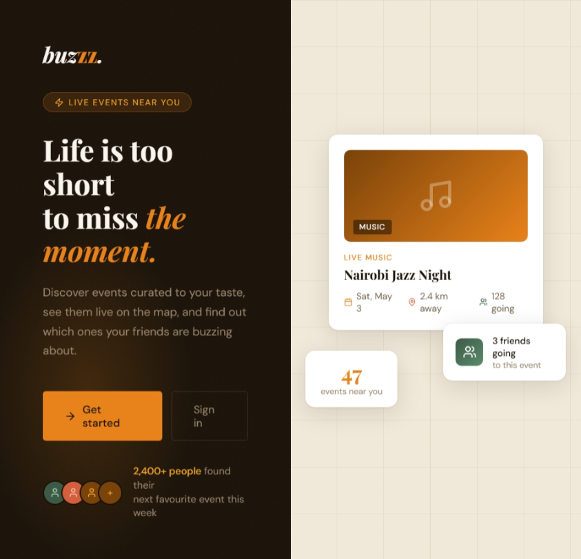
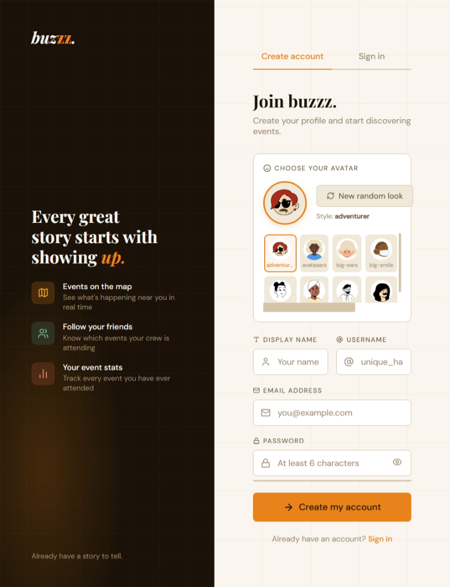
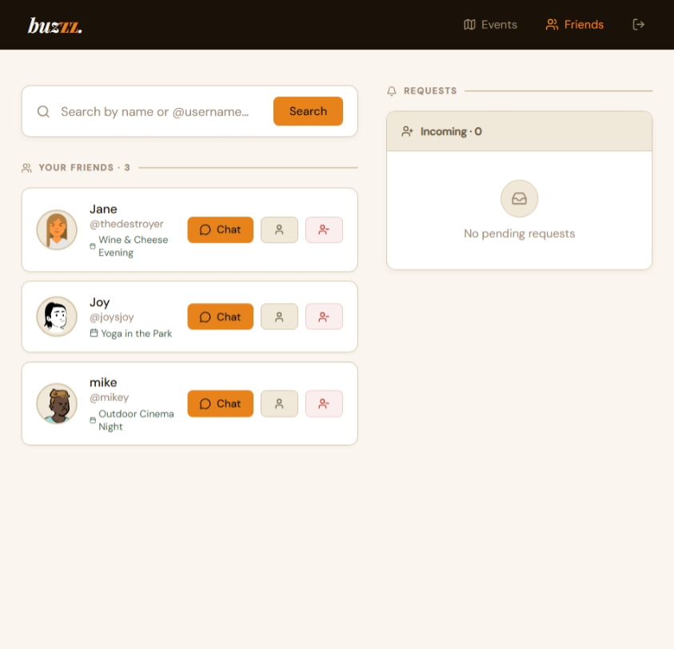

# buzzz. — Event Discovery & Social App

## Overview

buzzz. is a location-based event discovery and social platform that helps users find events, connect with friends, and track their social activity over time.

The app combines personalised recommendations, interactive maps, and social features into a single streamlined experience. Users can discover events happening around them, RSVP, see which friends are attending, chat, and analyse their activity through a stats dashboard.

The product follows a structured user journey:

Onboarding → Preferences → Event Discovery → Social Interaction → Stats

---

## Features

### Onboarding Experience

The application opens with a stylised peel-away welcome screen that transitions into the authentication flow. This provides a visually engaging entry point before users sign up or log in.

---

### Authentication & Profiles

Users can create accounts and log in securely.

Key features:

* Unique username system
* Password hashing using Werkzeug
* Custom avatars generated dynamically
* Editable user profiles

---

### Preference System

After signup, users complete a one-time preference setup to personalise their experience.

Preferences include:

* Event categories
* Travel distance
* Timing (weekdays or weekends)
* Price preference

These preferences influence the type of events shown in the feed.

---

### Event Discovery

The core of the application is the event feed and map.

Users can:

* Browse events in a card-based layout
* View event details including title, category, date, and location
* See events plotted on an interactive map
* Identify events by category through visual cues

Event data is sourced externally and seeded locally for development.

---

### Event Details & RSVP

Each event has a dedicated detail view where users can:

* Read full event information
* View location and timing
* RSVP to events

RSVPs are stored and used to power analytics and social features.

---

### Friends System

Users can connect with others on the platform.

Capabilities include:

* Sending and receiving friend requests
* Viewing a list of accepted friends
* Accessing friend profiles
* Tracking shared event attendance

---

### Messaging

The platform supports direct messaging between friends.

Features:

* Real-time-style chat using polling
* Message history storage
* Seen/unseen message tracking

---

### Stats Dashboard

Each user has access to a personal analytics dashboard.

Metrics include:

* Total events attended
* Favourite event category
* Monthly activity
* Attendance streaks
* Shared events with friends

Users can also view the stats of other users.

---

## Tech Stack

Backend:

* Python (Flask)
* SQLite

Frontend:

* HTML
* CSS
* JavaScript

Other:

* DiceBear API for avatar generation
* External event APIs (for sourcing event data)

---

## Project Structure

buzzz/
│
├── data/
│   └── buzzz.db
|   ├── app.db
│
├── templates/
│   ├── welcome.html
│   ├── auth.html
│   ├── events.html
│   ├── friends.html
│   ├── messages.html
│   ├── profile.html
│   └── stats.html
│
├── static/
│   ├── images/
│
├── main.py
├── seed.py
└── README.md

---

## Installation & Setup

1. Install dependencies

pip install flask werkzeug

2. Seed the database

python seed.py

3. Run the application

python main.py

4. Open in browser

http://localhost:5000

---

## Database Overview

The application uses SQLite with the following core tables:

* users
* friend_requests
* messages
* rsvps

The rsvps table powers event tracking and analytics.

---

## Development Notes

* The database is automatically initialised on first run.
* Schema changes require manual migration or database reset.
* Event data is seeded locally for development purposes.
* Chat uses polling rather than WebSockets.

---
## page displays

## Future Improvements

* Replace polling with WebSockets for real-time messaging
* Improve recommendation system using machine learning
* Add push notifications for events and messages
* Enhance map interactions and clustering
* Deploy to a cloud platform with persistent storage

---

## Status

This project is currently in active development, with core features implemented and ongoing improvements being made to performance, UI, and scalability.

## known bugs
None
 ## Support nad Contact information
 **email:** delarum7@gmail.com
 **Phone number:** 0792651083